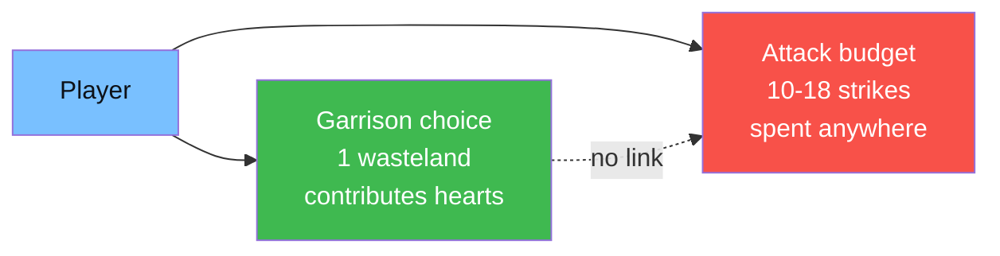
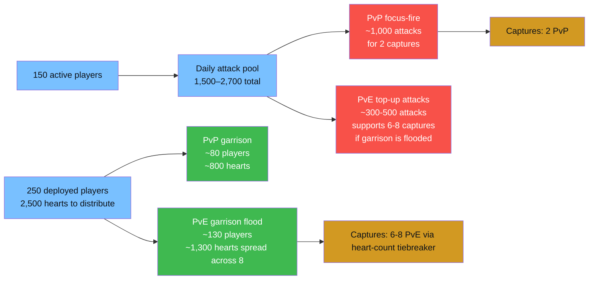

# Elemental Enhancements — Round 6 (Cycle 2) Deployment Plan

_Internal coordination doc for Server 2864 leadership · 90-minute window_

> **Context:** second Wasteland Publicity → Contest cycle of Round 6. Sector 32. This plan supersedes any earlier target list — please reconcile your marches to the priorities below before Contest opens.

---

## Snapshot

| Metric | Value |
|---|---|
| Server rank | **#46** (3,900 pts) |
| Holdings | 13 Lv.3 wastelands · 9 Neutral Cities · Warzone core |
| Roster | ~250 deployed · ~500 marches |
| Expected active in the 90-min window | **~150 players** |
| Daily attack budget (active × 10-18) | **~1,500 – 2,700 attacks** total |
| Declarations on the board | 45 offensive · 6 incoming defensive |
| Ally this round | **S1397** (comparable size, tactical coordination only — no standing comms channel) |
| Primary rival | **S3396** (active warzone) |
| Secondary contestants | S2463, S3940, S2953, S3649, S1120, S1677, S208 |

---

## Read this first: garrison ≠ attack

Two completely decoupled commitments per player:

- **Garrison** — where your 2 marches sit for the round. Adds hearts to that wasteland's defensive pool. Stuck there.
- **Attacks** — your personal 10-18 attack budget for the day. Spent on **any** wasteland, regardless of where you're garrisoned.

That decoupling is the whole plan. A player can garrison in an uncontested PvE wasteland (padding our hearts so we win that target passively) **while spending every one of their attacks on a PvP front**. Garrison and attacks get optimized independently.

**Priority order:**
1. **Win PvP fights first** — these are the hard fights that need real attack investment and concentrated garrison.
2. **Flood PvE garrisons second** — soaks up any remaining players cheaply, since PvE doesn't counter-attack.
3. **Attack PvE only when necessary** — just enough to push our heart count past theirs, then pivot immediately.

---

## Why concentration beats spreading

Each active player has a **personal daily attack budget** — ~10 attacks if the enemy plays optimally (empty small ships), up to ~18 with compound bonuses (only when the enemy leaves smalls manned). Across 150 active that's a ceiling of ~2,700 attacks **for the entire day, across every front combined**.

45 declarations ÷ 150 active = 3 players/target average — loses every fight. Concentrate on 8-12 targets instead, and we take them all.

---

## Buff-gap priorities (what new captures unlock)

Combat buffs stack globally up to effect caps. These are the biggest gaps we can close this cycle:

| Effect | Current | Cap | Gap | Notes |
|---|---:|---:|---:|---|
| 🔴 **DMG Reduction** | 45% | 300% | **85%** | Each Lv.3 wasteland = +45%. 3 eligible targets. |
| 🔴 **DMG Increase** | 45% | 300% | **85%** | Each Lv.3 wasteland = +45%. 4 eligible. |
| 🔴 **HP Buff** | 270% | 1800% | **85%** | Each Lv.3 = +270%. 5 eligible. |
| 🟡 Realm Thief (pass drop) | 10% | 50% | 80% | Utility, lower priority |
| 🟠 **DEF Buff** | 30% | 100% | 70% | Each Lv.3 = +15%. 6 eligible. |
| 🟠 **ATK Buff** | 540% | 1800% | 70% | Each Lv.3 = +270%. 6 eligible. |
| 🟢 Train Passenger | 1 | 3 | 67% | Utility, skip |
| 🟢 Realm March Speed | 40% | 100% | 60% | Utility, skip |

Combat Lv.3 captures compound — buffs apply to every battle we fight for the rest of the event. Order: HP → DMG Inc → DMG Red → DEF → ATK.

---

## Deployment tiers

### Tier A — PvP focus-fire (3 targets, top priority)

"Win these or we wasted the day." All three get the same Priority-1 treatment: concentrated garrison, focus-fire attacks, and Mothership-only posture. W-208 is now a committed push on S3396 rather than a conditional ally-assist — ally S1397 pile-on is welcome if they call it, but we do not wait for it.

| Target | Spec | Opponent | Garrison | Attack focus | Posture |
|:---:|---|---|---:|---:|---|
| **W-208** | DMG Increase Lv.3 | S3396 | **45 players** | ~450 attacks concentrated | Mothership only · **smalls empty** |
| **W-192** | HP Buff Lv.3 | S1120 (1v1) | 30 players | ~300 attacks concentrated | Mothership only · **smalls empty** |
| **W-5** | DMG Increase Lv.3 | S1677 (1v1) | 30 players | ~300 attacks concentrated | Mothership only · **smalls empty** |

**Rules for Tier A:**
- **Fill Mothership, nothing in Sweeper or Patrol.** Denies the opponent compound bonuses — caps them at 10 flat per player.
- Garrisoned players should spend their attacks on their own target (focused fire, no split).
- W-208 is the heaviest commitment; W-192 / W-5 are thinner — if kills lag at T-30 on any of the three, redirect surplus attacks from Tier C-garrisoned active players to whichever Tier A fight is closest to flipping.
- Attack budget is tight across three PvP targets — expect to need every active player's attack budget directed at Tier A at some point in the 90 minutes.

### Tier C — PvE garrison flood (6-8 passive captures)

**The strategy here is garrison-first, attack-minimal.** Since PvE opponents don't attack us, every march we commit to a PvE wasteland is pure heart padding. Flood garrison wide, and attacks to each target drop dramatically — or hit zero.

**The math (per Lv.3 PvE wasteland, 220 total hearts):**

| Our garrison | Our hearts | Attacks needed to cross threshold |
|---:|---:|---|
| 10 players (20 marches) | 100 | **Kill 121 of their hearts** (PvE smalls first) |
| 15 players | 150 | **Kill 71** |
| 20 players | 200 | **Kill 21** |
| 22 players | **220** | **Kill 1** (or 0 — passive tiebreaker wins it) |
| 25+ players | 250+ | **Zero attacks** — passive win at timer |

**Spread ~130 garrison across 6-8 PvE targets (16-20 per target)**, then top up with minimal attacks. PvE smalls are always manned so compound bonuses apply — you need ~20-40 compound attacks per target to cross the threshold, freeing nearly all attack budget for Tier A/B.

**Target list (all uncontested Lv.3 combat):**

| Target | Spec | Garrison | Top-up attacks |
|:---:|---|---:|---:|
| **W-320** | HP Buff Lv.3 | 18 | ~40 |
| **W-269** | DEF Buff Lv.3 | 18 | ~40 |
| **W-250** | DMG Reduction Lv.3 | 18 | ~40 |
| **W-47** | ATK Buff Lv.3 | 18 | ~40 |
| **W-27** | ATK Buff Lv.3 | 18 | ~40 |
| **W-77** | Truck Transport Lv.3 | 18 | ~40 |

**Mid-battle rule — PIVOT FAST:** the moment our heart count exceeds the PvE Mothership's remaining hearts on a target, **every attacker immediately stops** hitting it and rerolls onto the next PvE target or a Tier A front. Staying past the pivot point is wasted budget.

### Tier D — Defense (garrison only, passive)

Defenders don't attack unless counter-raiding. Just need hearts on the wall.

| Target | Spec | Incoming | Garrison | Intent |
|:---:|---|---|---:|---|
| **W-92** | HP Buff Lv.3 | S3940 (1 attacker) | **12** | Real hold — Mothership packed, smalls empty |
| **W-93** | ATK Buff Lv.3 | S3940 + S2463 | 4 | Token — expected loss, don't overspend |
| **W-76** | Truck Transport | S2953 | 2 | Stall only |
| **W-58** | Realm | S2953 | 2 | Stall only |
| **W-356** | Realm | S3649 | 2 | Stall only |
| **W-357** | Truck Heist | S921 | 2 | Stall only |

### Tier E — Flex reserve

- **NC reinforcement** (when NC Declaration opens): 10 players ready to redeploy to #3004 / #3005 if contested.
- **Late pile-on reserve**: remaining flex held for whichever Tier A target is lagging closest to timer.

---

## Budget check

### Garrison (250 deployed)

| Tier | Players |
|---|---:|
| A — PvP focus (3 targets: 45/30/30) | 105 |
| C — PvE flood (6 × 18) | 108 |
| D — Defense | 24 |
| E — Flex / NC | 13 |
| **Total committed** | **~250** |

Fits 250 deployed exactly — no buffer. If player count runs short, trim Tier C to 5 targets before touching Tier A.

### Attacks (150 active → 1,500 – 2,700 budget)

| Spend | Attacks |
|---|---:|
| A — PvP focus-fire (3 × ~350 avg) | ~1,050 |
| C — PvE threshold top-ups (6 × ~40) | 240 |
| D — Defense counter-raid spare | 0 – 100 |
| Reserve / flex (redirect to Tier A as needed) | 150 – 1,300+ |
| **Total projected** | **~1,200 – 1,890** |

Under-commits the upper range by design — gives buffer for Tier A attrition escalation or late Tier C pivot recoveries.

---

## Do Not Attack — without leadership confirmation

Declarations can't be withdrawn mid-round — these wastelands stay on our declaration list but **should not be attacked** by default. Garrisoning in them is fine (free hearts cost us nothing); spending attacks there is what drains the budget.

**Threat model:** only **S3396** is a peer. **S1397** is ally. Everyone else (S2463, S208, S3940, S2953, S3649, etc.) is weaker than us, so wastelands owned or contested by them are **winnable if a leader redirects budget** — we just aren't prioritizing them below our current Tier A / C commitments. These are deprioritized for attack budget, not because they're unwinnable.

### Contested combat (not prioritized)

| Target | Spec | Why deprioritized |
|:---:|---|---|
| **W-91** | ATK Lv.3 | 3-way vs S3396 + S3940 — S3396 dilutes, 3-way drain. |
| **W-225** | DMG Red Lv.3 | 3-way vs S3396 + S2463 — S3396 dilutes, 3-way drain. |
| **W-111** | DEF Lv.3 | vs S2463 — **winnable**, flag if leader wants to add. |
| **W-215** | DMG Inc Lv.3 | vs S208 — **winnable**, flag if leader wants to add. |
| **W-229** | DEF Lv.2 | Lower level, lower buff-gap value. |

### Contested non-combat (17)

| Target | Spec | Contest |
|:---:|---|---|
| **W-7** | Mining Hub Lv.3 | vs S3396 |
| **W-37** | Truck Heist Lv.3 | vs S2953 |
| **W-62** | Mining Hub Lv.3 | vs S420 |
| **W-63** | Realm Lv.1 | vs S2463 |
| **W-75** | Realm Lv.3 | S3853 owner |
| **W-82** | Realm Thief Lv.3 | vs S2463 |
| **W-94** | Truck Heist Lv.3 | vs S2463 |
| **W-196** | Truck Transport Lv.3 | vs S208 |
| **W-205** | Daily Tasks Lv.3 | vs S2463 |
| **W-228** | Realm Lv.3 | vs S3396 |
| **W-234** | Seal Stone Train Lv.3 | 3-way vs S208 + S1404 |
| **W-242** | Realm Lv.3 | S3396 owner |
| **W-244** | Daily Tasks Lv.3 | 3-way vs S2579 + S3902 |
| **W-301** | Realm Thief Lv.3 | S3396 owner |
| **W-337** | Mining Hub Lv.3 | vs S3649 |
| **W-424** | Realm Lv.1 | vs S2463 |
| **W-445** | Truck Heist Lv.3 | 3-way vs S3649 + S2463 |

Notes:
- Only S3396-owned / S3396-contested entries above (W-228, W-242, W-301) are genuinely tough fights. Our one committed S3396 push is already W-208 in Tier A.
- Weak-opponent entries (S2463 / S208 / S2953 / S3649 / S420 / S3853 / S3902 / S2579 / S3940 / S1404) are **winnable** — they're deprioritized because the three-target Tier A already stretches our attack budget, not because we can't beat them. Leadership can promote any into a Priority 2 fight by redirecting budget from Tier C.

### Uncontested non-combat

14 of 15 uncontested non-combat wastelands — skip attacks. Keep only **W-77** (Truck Transport Lv.3) in Tier C pickups.

---

## Ally message draft (S1397)

> "R6 Publicity 2 coordination from S2864: we're committing Priority-1 on W-208 (DMG Inc vs S3396) with 45 players, plus W-192 (HP vs S1120) and W-5 (DMG Inc vs S1677) at 30 each, and 6 uncontested Lv.3 combat pickups (W-320, W-269, W-250, W-47, W-27, W-77). We're letting W-91, W-225, W-111, W-215 go — not spending attacks there. A pile-on from you on W-208 or any other S3396 wasteland would help a lot. Please share your top targets so we de-conflict."

---

## Contingency triggers

| If… | Then… |
|---|---|
| Activity under 130 by T-30 min | Trim Tier C to 4 targets (bump per-target garrison to 22). Keep Tier A at 45/30/30. |
| A Tier C target gets contested late | Stop attacking it — PvE economics don't hold vs a real defender. Redirect attacks to Tier A. |
| S1397 confirms S3396 focus-fire on W-208 | Have flex reserve drop garrison on W-208 and direct spare attacks there. |
| We're clearly winning one Tier A target by T-30 | Redirect its attackers' remaining budget to whichever other Tier A target is lagging. |
| Lv.3 NC attack incoming | Pull 10 flex players to reinforce, MS-only posture. |

---

## Execution checklist

- [ ] **T-60:** Confirm active list — ping marchall heads for activity commitments.
- [ ] **T-45:** Broadcast the Do-Not-Attack list to all players — no attacks on W-91, W-225, W-111, W-215, W-229, or non-combat wastelands without a leader call.
- [ ] **T-30:** Final garrison in — W-208 at 45, W-192 and W-5 at 30 each, Tier C at 18 each, Tier D at spec, Tier E in reserve.
- [ ] **T-15:** Confirm S1397 coordination (if any) — sync on W-208 or other S3396 fronts they're pushing.
- [ ] **T-0:** Contest opens. **Focus-fire protocol:**
  - [ ] Tier A: all designated attackers focus the **same enemy Mothership in rotation** — no splitting.
  - [ ] Tier C: attackers hit PvE smalls first (cheap 1-heart kills trigger compound bonuses), then Mothership. **PIVOT** the moment our heart pool exceeds theirs — don't linger.
  - [ ] Defenders (Tier D): zero attack output unless a counter-raid window opens. Hold hearts.
  - [ ] Flex (Tier E): watch the Tier A kill-rate. Redirect attacks at T-60-minute mark if either fight is lagging.
  - [ ] Player discipline: no Rockfield, strongest march only, wait 10 sec for chat calls before spending an attack if it's close, ask a leader when unsure.

---

_Plan compiled 2026-04-22. Reviewed by Alfred and multi-subagent persona advisory passes before publication. Reconcile questions with coordination team before Contest opens._
