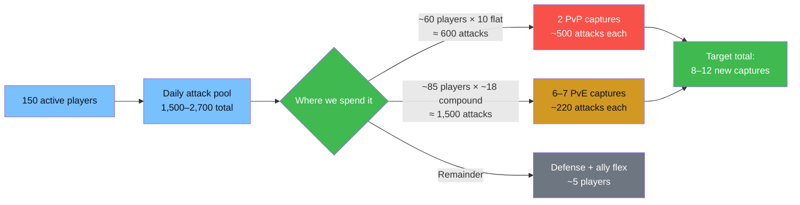

# Elemental Enhancements — Round 6 (Cycle 2) Deployment Plan

_Internal coordination doc for Server 2864 leadership · 90-minute window_

> **Context:** second Wasteland Publicity → Contest cycle of Round 6. Sector 32. This plan supersedes any earlier target list — please reconcile your marches to the priorities below before Contest opens.

---

## Snapshot

| Metric | Value |
|---|---|
| Server rank | **#46** (3,900 pts) |
| Holdings | 13 Lv.3 wastelands · 9 Neutral Cities · Warzone core |
| Roster | ~250 deployed · ~500 marches |
| Expected active in the 90-min window | **~150 players** |
| Daily attack budget (active × 10-18) | **~1,500 – 2,700 attacks** total |
| Declarations on the board | 45 offensive · 6 incoming defensive |
| Ally this round | **S1397** (comparable size, coordination over voice) |
| Primary rival | **S3396** (active warzone) |
| Secondary contestants | S2463, S3940, S2953, S3649, S1120, S1677, S208 |

---

## Why this plan concentrates

Each active player has a **personal daily attack budget** — ~10 attacks if the enemy plays optimally (empty small ships), up to ~18 with compound bonuses (only when the enemy leaves smalls manned). Across 150 active that's a ceiling of ~2,700 attacks **for the entire day, across every front combined**.

**Concentration math:** 45 declarations ÷ 150 active = 3 players/target average — loses every fight. 10 focused targets = 15 players/target with room to pile extra onto 2-3 PvP wins. **Most declarations will be abandoned** in favor of focus-fire.

---

## Buff-gap priorities (what new captures unlock)

Combat buffs stack globally up to effect caps. These are the biggest gaps we can close this cycle:

| Effect | Current | Cap | Gap | Notes |
|---|---:|---:|---:|---|
| 🔴 **DMG Reduction** | 45% | 300% | **85%** | Each Lv.3 wasteland = +45%. 3 eligible targets. |
| 🔴 **DMG Increase** | 45% | 300% | **85%** | Each Lv.3 wasteland = +45%. 4 eligible. |
| 🔴 **HP Buff** | 270% | 1800% | **85%** | Each Lv.3 = +270%. 5 eligible. |
| 🟡 Realm Thief (pass drop) | 10% | 50% | 80% | Utility, lower priority |
| 🟠 **DEF Buff** | 30% | 100% | 70% | Each Lv.3 = +15%. 6 eligible. |
| 🟠 **ATK Buff** | 540% | 1800% | 70% | Each Lv.3 = +270%. 6 eligible. |
| 🟢 Train Passenger | 1 | 3 | 67% | Utility, skip |
| 🟢 Realm March Speed | 40% | 100% | 60% | Utility, skip |

**Strategy takeaway:** every combat Lv.3 capture compounds — buffs apply to every battle we fight for the rest of the event. Prioritize HP / DMG Inc / DMG Red / DEF / ATK in that order.

---

## Deployment tiers

### Tier A — PvP focus-fire (2 targets)

Our "win these or we wasted the day" list. Winnable 1v1 fights against secondary-tier rivals.

| Target | Spec | Opponent | Garrison | Attack allocation | Posture |
|:---:|---|---|---:|---:|---|
| **W-192** | HP Buff Lv.3 | S1120 (1v1) | 40 players | ~400 attacks | Mothership only · smalls empty |
| **W-5** | DMG Increase Lv.3 | S1677 (1v1) | 40 players | ~400 attacks | Mothership only · smalls empty |

**Rules for these two:**
- **Fill Motherships first**, nothing in Sweeper or Patrol. We deny the opponent compound bonuses and force them to a flat 10 attacks/player.
- Any player not assigned elsewhere should lean here first.
- If your attack budget is left after supporting a PvE target, spend the rest on the PvP Mothership with the better kill progress.

### Tier B — Coordination play (conditional)

| Target | Spec | Opponent | Plan |
|:---:|---|---|---|
| **W-208** | DMG Increase Lv.3 | S3396 | Ask S1397 to pile on S3396's declarations. If they commit, we reinforce with **25 players + ~250 attacks**. If they don't, concede. |

### Tier C — Clean pickups (6 uncontested Lv.3 combat)

No other server has declared on these. PvE smalls are always manned → compound bonuses apply → ~18 attacks/player against 220 heart points.

| Target | Spec | Garrison | Attacks | Clears in |
|:---:|---|---:|---:|---|
| **W-320** | HP Buff Lv.3 | 13 players | ~230 | 13 × 18 = 234 |
| **W-269** | DEF Buff Lv.3 | 13 | ~230 | same |
| **W-250** | DMG Reduction Lv.3 | 13 | ~230 | same |
| **W-47** | ATK Buff Lv.3 | 13 | ~230 | same |
| **W-27** | ATK Buff Lv.3 | 13 | ~230 | same |
| **W-77** | Truck Transport Lv.3 | 12 | ~220 | 12 × 18 = 216 |

**Rules for Tier C:**
- Fill **Mothership** — small ships are optional and don't hurt us (the opponent is AI, doesn't care about our posture).
- If you have nothing else to attack, drop your remaining attacks into any Tier C target.

### Tier D — Defense (garrison only, no attack spend required)

Defenders are passive — we just need hearts on the wall.

| Target | Spec | Incoming | Garrison | Intent |
|:---:|---|---|---:|---|
| **W-92** | HP Buff Lv.3 | S3940 (1 attacker) | **12** | Real hold — Mothership packed, smalls empty |
| **W-93** | ATK Buff Lv.3 | S3940 + S2463 | 4 | Token — expected loss, don't overspend |
| **W-76** | Truck Transport | S2953 | 2 | Stall only |
| **W-58** | Realm | S2953 | 2 | Stall only |
| **W-356** | Realm | S3649 | 2 | Stall only |
| **W-357** | Truck Heist | S921 | 2 | Stall only |

**Total defense garrison: 24 players** (no attack budget consumed — defenders don't attack unless counter-raiding).

### Tier E — Flex reserve (~30 players)

- **Neutral City reinforcement** (when NC Declaration opens): 15 players ready to redeploy to #3004 / #3005 if contested.
- **Ally-response flex**: 15 players held for last-minute pile-on with S1397 on any S3396 front we can open.

---

## Budget check

| Tier | Garrison (players) | Attack budget (approx) |
|---|---:|---:|
| A — PvP focus | 80 | 800 |
| B — Ally assist | 25 (conditional) | 250 |
| C — PvE pickups | 77 | 1,380 |
| D — Defense | 24 | 0 – 100 |
| E — Flex / NC | 30 | 0 – 200 |
| **Total** | **~236** | **~2,430 – 2,730** |

Fits the upper half of the 1,500-2,700 active range. If activity comes in below 130, drop Tier B entirely and one Tier C target. If above 170, push Tier E into a 7th PvE pickup.

---

## Concede list (withdraw declarations before Contest)

These are attack-budget holes we cannot afford:

| Target | Spec | Why concede |
|:---:|---|---|
| **W-91** | ATK Lv.3 | 3-way vs S3396 + S3940. Budget hole. |
| **W-225** | DMG Red Lv.3 | 3-way vs S3396 + S2463. Budget hole. |
| **W-111** | DEF Lv.3 | S2463 entrenched owner. Too hard to flip. |
| **W-215** | DMG Inc Lv.3 | S208 owner. Lower ROI. |
| **W-229** | DEF Lv.2 | Lower level. Skip for Lv.3 pickups. |
| All 17 contested non-combat | — | Below priority threshold. |
| 14 of 15 uncontested non-combat | — | Keep only W-77 (Truck Transport). |

---

## Ally message draft (for S1397 leadership)

> "R6 Publicity 2 coordination from S2864: we're pushing W-192 (HP vs S1120), W-5 (DMG Inc vs S1677), plus 6 uncontested Lv.3 combat pickups (W-320, W-269, W-250, W-47, W-27, W-77). We're conceding W-91, W-225, W-111, W-215 (the S3396/S2463 fronts) — can you pile on at least one S3396 wasteland? If you hit W-208, we'll reinforce with 25 players. Please confirm your top 3 so we de-conflict."

---

## Contingency triggers

| If… | Then… |
|---|---|
| Activity under 130 by T-30 min | Drop Tier B. Hold Tier A at 40 each, trim Tier C to 5 targets. |
| A Tier C target gets contested late | Concede that one, redirect players/attacks to flex reserve. |
| S1397 confirms S3396 focus-fire | Activate Tier B (+25 players, +250 attacks). |
| We're ahead on both Tier A kills by T-30 | Commit flex attacks to the weaker one to guarantee both. |
| Lv.3 NC attack incoming | Pull 15 flex players to reinforce, MS-only posture. |

---

## Execution checklist

- [ ] **T-60:** Confirm active list — ping marchall heads for activity commitments.
- [ ] **T-45:** Withdraw declarations on concede list (W-91, W-225, W-111, W-215, W-229 + non-combat).
- [ ] **T-30:** Final garrison in — Tier A at 40 each, Tier C at 12-13 each, Tier D at spec, Tier E in reserve.
- [ ] **T-15:** Confirm S1397 Tier B commit (yes/no) → activate or concede W-208.
- [ ] **T-0:** Contest opens. **Focus-fire protocol:**
  - [ ] All PvP attackers hit the same opposing Mothership in rotation (no splitting fire)
  - [ ] PvE attackers clear their target's smalls first (cheap kills = compound bonuses), then mop up the Mothership
  - [ ] Defenders do nothing active; absorb attacks and hold hearts

---

_Plan compiled 2026-04-22. Reviewed by Alfred and multi-subagent persona advisory passes before publication. Reconcile questions with coordination team before Contest opens._
