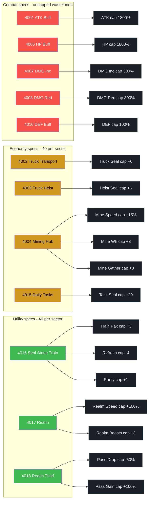
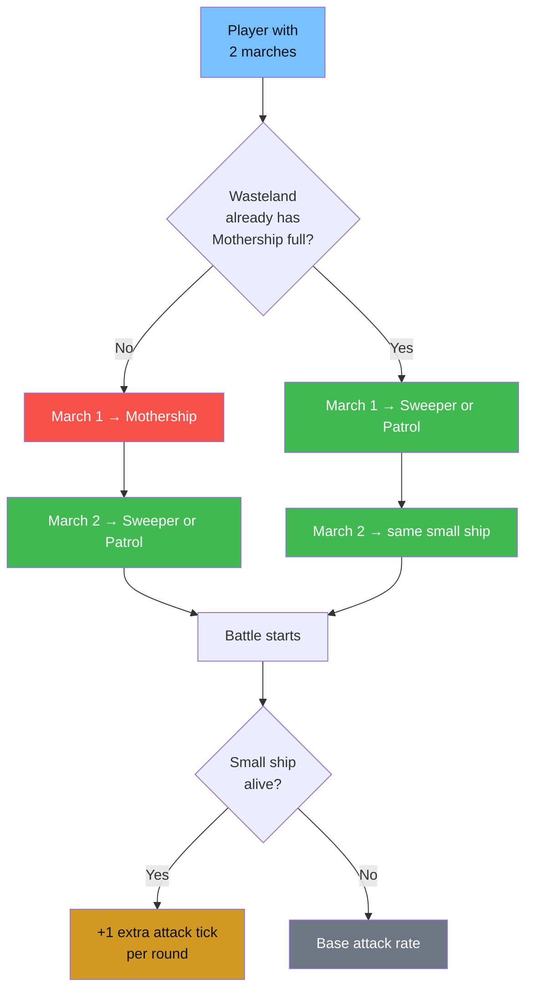
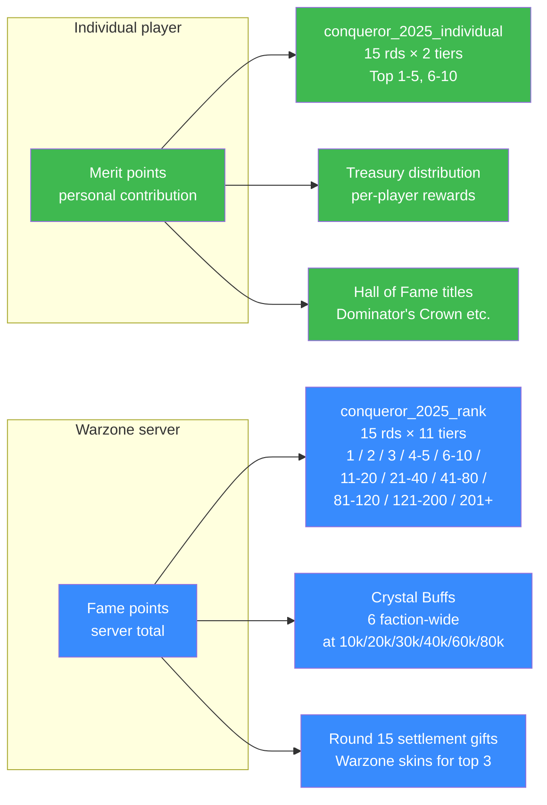
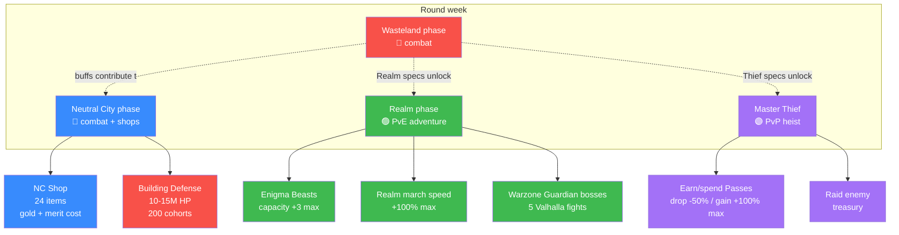
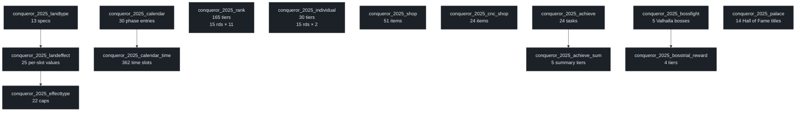

# Seal Stone Chaos — Event Reference

_Also known as: **Ultimate Dominators (UD)**, **Conqueror 2025**, **SSC**_

Top War's 15-round inter-server warzone event. Warzones fight over a 24×24 sector map of **wastelands** (pooled stat buffs) and **neutral cities** (shops + scoring), with sub-events for **Seal Stone Realm** (Enigma Beasts) and **Master Thief's Heist** (raiding treasury).

Data derived from the game's in-memory tables (`conqueror_2025_*`, 54 tables, 1147 rows) and the live `CQ25MapData` / `WastelandMainInfoView` scene components.

---

## 1. Round structure

Each of the 15 rounds cycles through the same 7-phase structure. A round can contain **multiple Publicity→Contest cycles** for wastelands (first week was 2 cycles in Round 6).

**Neutral City level unlocks:**

| Round | Unlocks |
|:-----:|---------|
| 1 | Lv.1 NCs |
| 2 | Lv.2 NCs |
| 3 | Lv.3 NCs |
| 4 | Lv.4 NC = **Storm's Eye** |

Sector reassignments can happen between rounds (Server 2864 moved sector 16 → 32 after R4.5). The event state persists but the map resets.

---

## 2. Wasteland specs

Each wasteland has a **spec** (determines what buff it yields), a **level** (1/2/3), and 3 buff slots. Slot 1 fills at L1, slot 2 at L2, slot 3 at L3. Buffs stack across every wasteland your warzone owns, up to per-effect caps.

### Spec table (13 types)

| ID | Name | Category | L1 | L2 | L3 | Cap-per-sector |
|---:|------|:--------:|------|------|------|:--------------:|
| 4001 | ATK Buff | 🔴 combat | +90% | +180% | +270% | unlimited |
| 4006 | HP Buff | 🔴 combat | +90% | +180% | +270% | unlimited |
| 4007 | DMG Increase | 🔴 combat | +15% | +30% | +45% | unlimited |
| 4008 | DMG Reduction | 🔴 combat | -15% | -30% | -45% | unlimited |
| 4010 | DEF Buff | 🔴 combat | +5% | +10% | +15% | unlimited |
| 4002 | Truck Transport | 🟡 economy | Seal +1 | Seal +2 | Seal +3 | 40 |
| 4003 | Truck Heist | 🟡 economy | Seal +1 | Seal +2 | Seal +3 | 40 |
| 4004 | Mining Hub | 🟡 economy | Speed +5% | Warehouse +1 | Gather +1 | 40 |
| 4015 | Daily Tasks | 🟡 economy | Seal +2 | Seal +4 | Seal +6 | 40 |
| 4016 | Seal Stone Train | 🟢 utility | Pax +1 | Refresh -2 | Rarity +1 | 40 |
| 4017 | Realm | 🟢 utility | Speed +10% | Speed +20% | +1 Eni Beast | 40 |
| 4018 | Realm Thief | 🟢 utility | Pass drop -10% | Gain +10% | Gain +20% | 40 |
| 4080 | Treasury Reward | ⭐ special | +1 | +2 | +3 | unlimited |

### Spec → Effect → Cap pipeline

---

## 3. Ship mechanics (wasteland + NC battles)

Each player commits marches to one wasteland. Each wasteland has 3 ship types with different capacities and hearts.

| Ship | Slots | Hearts | Role |
|------|:-----:|:------:|------|
| **Mothership** | 100 | 5 | Primary carrier — should be filled first |
| **Sweeper** | 50 | 3 | Secondary — unlocks extra attack ticks |
| **Patrol** | 50 | 3 | Secondary — unlocks extra attack ticks |

### Deployment rules

**Rules of thumb:**
- 1 player = 1 wasteland only (can't split)
- Both marches to the same wasteland
- Primary in Mothership, secondary in a small ship
- Don't skip small ships — the extra attack ticks while Sweeper/Patrol are alive are a major throughput boost

---

## 4. Scoring & rewards

Two independent scoring systems drive what you win:

### Occupy rewards (progress bar)

Earn points by holding wastelands during Contest. Tier rewards at:

| Points | Reward |
|-------:|:------:|
| 1,000 | Tier 1 |
| 2,000 | Tier 2 |
| 3,000 | Tier 3 |
| 4,000 | Tier 4 |

---

## 5. Sub-events inside a round

### Neutral Cities (NCs)

- **Type-2 cells** in the 24×24 grid, named `Lv. N Neutral City #XXXX`
- Level unlocks tied to round number (see §1)
- **Storm's Eye (Lv.4)** — special CNC building with 60-min battle timeline, unlocked in R4
- Whoever owns an NC gets access to its **NC Shop** (24 gold-cost items + merit score gate)

### Seal Stone Realm

- PvE map unlocked during Realm phase
- **Enigma Beasts** — collectible stat-boost entities. Spec 4017 (Realm) unlocks +1 Beast carry slot per L3 wasteland (cap +3)
- **Warzone Guardian bosses** — 5 Valhalla monsters (monster_id `6100001`) that feed the "Ragnarok" achievement
- March speed inside the Realm: +100% cap from spec 4017

### Master Thief's Heist

- Hold a **Pass** → raid an enemy warzone's Treasury
- Spec 4018 (Realm Thief) reduces pass drop on defeat (-50% cap) and boosts pass gain (+100% cap)

---

## 6. Mining Hubs

Spec 4004 (Mining Hub) boosts all four mine tiers:

| Tier | Duration | Food | Oil | Thorium |
|:----:|---------:|-----:|----:|--------:|
| 1 | 14h | 1.2M | 1.2M | 400 |
| 2 | 14h | 2.5M | 2.5M | 600 |
| 3 | 14h | 4.2M | 4.2M | 800 |
| 4 | 14h | 6.3M | 6.3M | 1,000 |

Speed +5% · Warehouse +1 · Gather +1 (from the 3 spec 4004 slots).

---

## 7. Event buffs outside wastelands

### Crystal Buffs (faction-wide, from Fame points)

| Fame threshold | Buff |
|---------------:|------|
| 10,000 | Crystal Buff 1 — ATK +10% |
| 20,000 | Crystal Buff 2 — HP +10% |
| 30,000 | Crystal Buff 3 — ATK +10% |
| 40,000 | Crystal Buff 4 — HP +10% |
| 60,000 | Crystal Buff 5 — DMG Inc +3% |
| 80,000 | Crystal Buff 6 — DMG Red +3% |

### Global Boosts (task-point thresholds)

| Threshold | Boost |
|----------:|-------|
| 3,000 | Gathering Speed +10% |
| 18,000 | HP +10% & ATK +10% |
| 60,000 | Training Speed +10% & March Speed +10% |
| 150,000 | Repair Factory capacity +50 |

---

## 8. Hall of Fame (event-end titles)

14 end-of-event titles. Each has its own ranking criteria:

| # | Title | Awarded for |
|:-:|-------|-------------|
| 1 | Dominator's Crown | Most Merit overall |
| 2 | Dominator's Hammer | Most Merit from 2nd-ranked faction |
| 3 | Dominator's Blade | Most Merit from 3rd-ranked faction |
| 4 | Dominator's Sword | Most Valhalla units destroyed |
| 5 | Dominator's Shield | Most Merit from defending NC buildings |
| 6-14 | _various_ | Category-specific top contributors |

Plus **Warzone skins** for top 3 servers at Round 15 settlement (`warzone_skin: 601 / 602 / 603`).

---

## 9. Strategy notes

### Which specs to prioritize

The wasteland cap system matters:
- **Combat specs (ATK/HP/DMG/DEF)** are uncapped per-sector — you can own as many as you can hold, and each one stacks up to the global effect cap
- **Economy/utility specs** are capped at 40 per sector — the 41st doesn't help the whole warzone
- **DMG Increase and DMG Reduction have a 300% cap** but each L3 wasteland gives 45% — so you hit the cap with only 7 wastelands. Low-hanging fruit.

### Ship stacking

A fully-attacked wasteland has 200 total slots (100 MS + 50 Sw + 50 Pa) = enough for 100 players × 2 marches. In practice most wastelands see 30-80% fill. The winners are usually determined by **small-ship uptime**, not raw Mothership fill.

### Contested vs. uncontested declarations

`fightSids` in the wasteland's declaration data tells you who else declared. A 3-way fight splits the defending attention but also dilutes your reward share. Uncontested captures are free wins — target them first.

---

## 10. Data plumbing (for reference)

The event is driven by **54 `conqueror_*` tables** totaling ~1,147 rows. Key ones:

Every string key (e.g. `conqueror2025_wasteland_172`) resolves to localized text via the game's `LocalManager`.

---

_Last updated: 2026-04-22 during Round 6 Publicity (2). Data source: Server 2864 live game client (Cocos Creator 2.4.6 H5). Compiled for the S2864 community._
