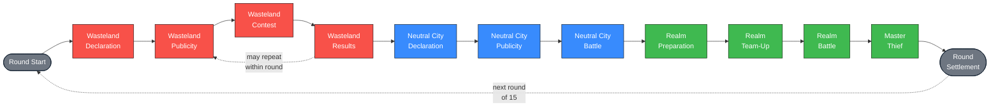
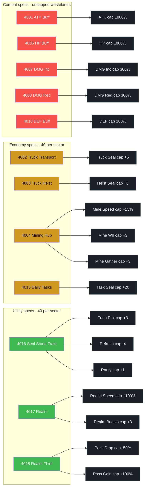
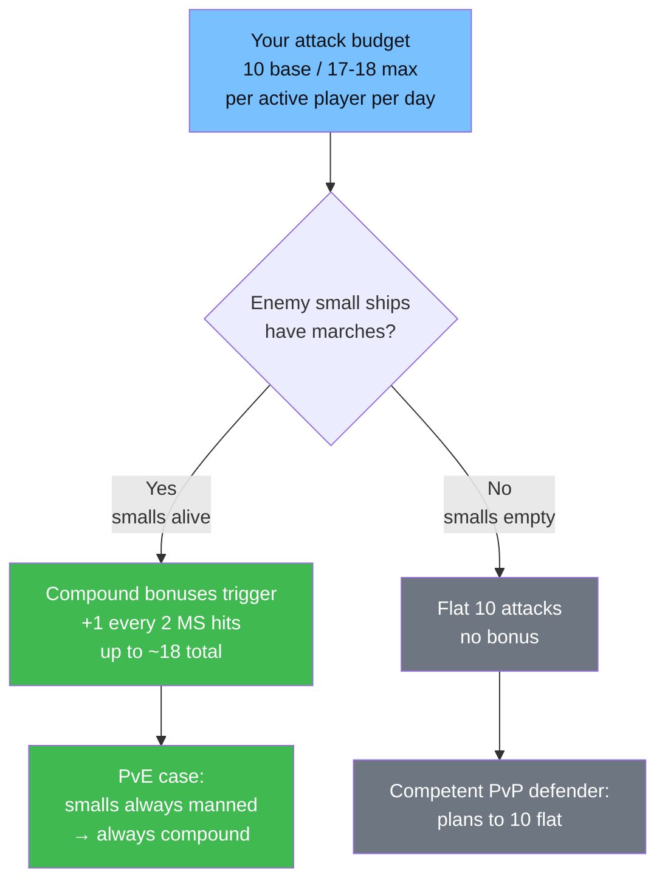
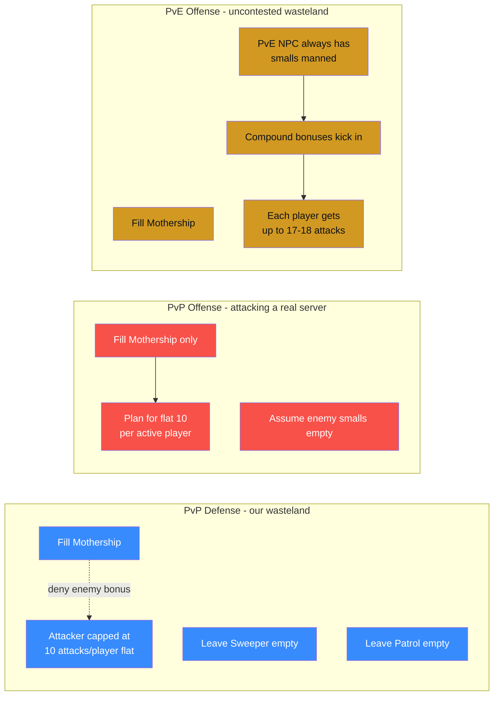
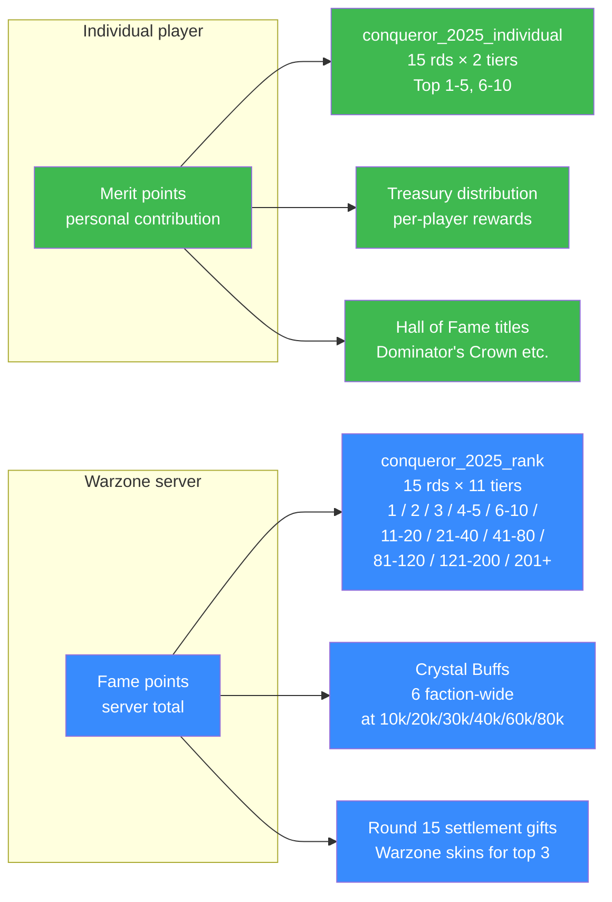
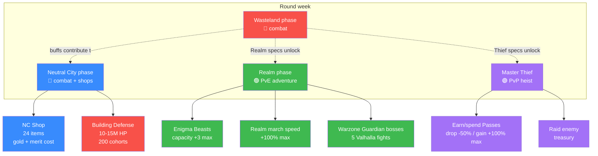
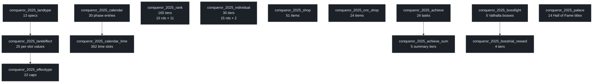

# Seal Stone Chaos — Event Reference

_Also known as: **Ultimate Dominators (UD)**, **Conqueror 2025**, **SSC**_

Top War's 15-round inter-server warzone event. Warzones fight over a 24×24 sector map of **wastelands** (pooled stat buffs) and **neutral cities** (shops + scoring), with sub-events for **Seal Stone Realm** (Enigma Beasts) and **Master Thief's Heist** (raiding treasury).

Data derived from the game's in-memory tables (`conqueror_2025_*`, 54 tables, 1147 rows) and the live `CQ25MapData` / `WastelandMainInfoView` scene components.

---

## 1. Round structure

Each of the 15 rounds cycles through the same 7-phase structure. A round can contain **multiple Publicity→Contest cycles** for wastelands (first week was 2 cycles in Round 6).

**Neutral City level unlocks:**

| Round | Unlocks |
|:-----:|---------|
| 1 | Lv.1 NCs |
| 2 | Lv.2 NCs |
| 3 | Lv.3 NCs |
| 4 | Lv.4 NC = **Storm's Eye** |

Sector reassignments can happen between rounds (Server 2864 moved sector 16 → 32 after R4.5). The event state persists but the map resets.

---

## 2. Wasteland specs

Each wasteland has a **spec** (determines what buff it yields), a **level** (1/2/3), and 3 buff slots. Slot 1 fills at L1, slot 2 at L2, slot 3 at L3. Buffs stack across every wasteland your warzone owns, up to per-effect caps.

### Spec table (13 types)

| ID | Name | Category | L1 | L2 | L3 | Cap-per-sector |
|---:|------|:--------:|------|------|------|:--------------:|
| 4001 | ATK Buff | 🔴 combat | +90% | +180% | +270% | unlimited |
| 4006 | HP Buff | 🔴 combat | +90% | +180% | +270% | unlimited |
| 4007 | DMG Increase | 🔴 combat | +15% | +30% | +45% | unlimited |
| 4008 | DMG Reduction | 🔴 combat | -15% | -30% | -45% | unlimited |
| 4010 | DEF Buff | 🔴 combat | +5% | +10% | +15% | unlimited |
| 4002 | Truck Transport | 🟡 economy | Seal +1 | Seal +2 | Seal +3 | 40 |
| 4003 | Truck Heist | 🟡 economy | Seal +1 | Seal +2 | Seal +3 | 40 |
| 4004 | Mining Hub | 🟡 economy | Speed +5% | Warehouse +1 | Gather +1 | 40 |
| 4015 | Daily Tasks | 🟡 economy | Seal +2 | Seal +4 | Seal +6 | 40 |
| 4016 | Seal Stone Train | 🟢 utility | Pax +1 | Refresh -2 | Rarity +1 | 40 |
| 4017 | Realm | 🟢 utility | Speed +10% | Speed +20% | +1 Eni Beast | 40 |
| 4018 | Realm Thief | 🟢 utility | Pass drop -10% | Gain +10% | Gain +20% | 40 |
| 4080 | Treasury Reward | ⭐ special | +1 | +2 | +3 | unlimited |

### Spec → Effect → Cap pipeline

---

## 3. Ship mechanics (wasteland + NC battles)

### Hearts (passive defense pool)

Hearts are the battle's HP bar. They're counted **per march**:

| Ship | Slots | Hearts per march | Max hearts (full fill) |
|------|:-----:|:----------------:|:----------------------:|
| **Mothership** | 100 | 5 | 500 |
| **Sweeper** | 50 | 3 | 150 |
| **Patrol** | 50 | 3 | 150 |
| **PvP total** | 200 | — | **800** |

**PvE (no real server defending)** uses a different pool: 100 MS + 60 Sw + 60 Pa marches each with **1 heart** → **220 hearts total**. PvE marches don't attack you — they sit there as a damage sponge.

### Attack economy (the number that actually decides fights)

This is the load-bearing rule and the one most players miss:

- **Each real player has ~10 base attacks total — for the whole 90-minute battle, across all wastelands combined.**
- That personal budget is not per-wasteland — it's a daily cap.
- Each successful attack deals **1 damage** (reduces 1 heart). A Mothership march (5 hearts) takes **5 successful hits** to kill. A small-ship or PvE march (3/1 hearts) dies faster.

**Bonus attacks (the small-ship rule):** for every **2 successful hits** you land on an opposing Mothership march, you earn **+1 bonus attack** — but **only if the opponent's small ships still have marches inside**. Bonuses compound (bonus attacks also count toward the next +1 trigger). Max ~**17-18 attacks** per active player when the opponent keeps smalls manned.

### The counterintuitive result: defenders keep smalls EMPTY

Because your small ships being manned **gives the enemy free attacks against your Mothership**, the optimal PvP defensive posture is to **leave Sweeper and Patrol empty** and pile everyone into the Mothership. That caps your defensive hearts at 500 (down from 800) but denies the attacker any compound bonuses — forcing them to spend 500 successful attacks to win, with no multiplier.

### Garrison vs. attacks

Two separate concepts:
- **Garrisoned marches** — committed to a wasteland, contribute to that wasteland's defensive heart pool. Stuck there for the round.
- **Personal attacks** — the 10-18 strikes a player can spend freely across any wastelands, regardless of where their marches are garrisoned.

You can attack a wasteland you're not garrisoned on. You can garrison in a wasteland and spend your attacks elsewhere. But each player has **1 garrison placement** (2 marches, 1 wasteland) and **1 daily attack budget**.

### Win conditions (90-minute timer)

1. Zero the opposing side's hearts before the timer expires → instant win.
2. Timer expires with both sides still alive → **whichever side has more hearts remaining** wins.

Because attack budgets are finite and daily, you can't out-attrition an opponent on every front — **you have to pick which wastelands you genuinely intend to win** and focus-fire there.

### Rules of thumb (corrected)

- 1 player = 1 wasteland garrison (can't split)
- Both marches to the same wasteland
- **Defense: Mothership only. Smalls empty.** Denies enemy bonus.
- **Offense (vs. real server): Mothership only**, plan for 10 flat attacks per active player against a competent defender.
- **Offense (PvE): Mothership heavy**, expect compound bonuses up to 18 attacks/player.
- Not every deployed player is active — plan attacks around the **active fraction** (rule of thumb: ~60% of deployed).
- Concentrate fire. Splitting 2,000 attacks across 45 targets wins nothing; splitting across 6 targets wins 6.

---

## 4. Scoring & rewards

Two independent scoring systems drive what you win:

### Occupy rewards (progress bar)

Earn points by holding wastelands during Contest. Tier rewards at:

| Points | Reward |
|-------:|:------:|
| 1,000 | Tier 1 |
| 2,000 | Tier 2 |
| 3,000 | Tier 3 |
| 4,000 | Tier 4 |

---

## 5. Sub-events inside a round

### Neutral Cities (NCs)

- **Type-2 cells** in the 24×24 grid, named `Lv. N Neutral City #XXXX`
- Level unlocks tied to round number (see §1)
- **Storm's Eye (Lv.4)** — special CNC building with 60-min battle timeline, unlocked in R4
- Whoever owns an NC gets access to its **NC Shop** (24 gold-cost items + merit score gate)

### Seal Stone Realm

- PvE map unlocked during Realm phase
- **Enigma Beasts** — collectible stat-boost entities. Spec 4017 (Realm) unlocks +1 Beast carry slot per L3 wasteland (cap +3)
- **Warzone Guardian bosses** — 5 Valhalla monsters (monster_id `6100001`) that feed the "Ragnarok" achievement
- March speed inside the Realm: +100% cap from spec 4017

### Master Thief's Heist

- Hold a **Pass** → raid an enemy warzone's Treasury
- Spec 4018 (Realm Thief) reduces pass drop on defeat (-50% cap) and boosts pass gain (+100% cap)

---

## 6. Mining Hubs

Spec 4004 (Mining Hub) boosts all four mine tiers:

| Tier | Duration | Food | Oil | Thorium |
|:----:|---------:|-----:|----:|--------:|
| 1 | 14h | 1.2M | 1.2M | 400 |
| 2 | 14h | 2.5M | 2.5M | 600 |
| 3 | 14h | 4.2M | 4.2M | 800 |
| 4 | 14h | 6.3M | 6.3M | 1,000 |

Speed +5% · Warehouse +1 · Gather +1 (from the 3 spec 4004 slots).

---

## 7. Event buffs outside wastelands

### Crystal Buffs (faction-wide, from Fame points)

| Fame threshold | Buff |
|---------------:|------|
| 10,000 | Crystal Buff 1 — ATK +10% |
| 20,000 | Crystal Buff 2 — HP +10% |
| 30,000 | Crystal Buff 3 — ATK +10% |
| 40,000 | Crystal Buff 4 — HP +10% |
| 60,000 | Crystal Buff 5 — DMG Inc +3% |
| 80,000 | Crystal Buff 6 — DMG Red +3% |

### Global Boosts (task-point thresholds)

| Threshold | Boost |
|----------:|-------|
| 3,000 | Gathering Speed +10% |
| 18,000 | HP +10% & ATK +10% |
| 60,000 | Training Speed +10% & March Speed +10% |
| 150,000 | Repair Factory capacity +50 |

---

## 8. Hall of Fame (event-end titles)

14 end-of-event titles. Each has its own ranking criteria:

| # | Title | Awarded for |
|:-:|-------|-------------|
| 1 | Dominator's Crown | Most Merit overall |
| 2 | Dominator's Hammer | Most Merit from 2nd-ranked faction |
| 3 | Dominator's Blade | Most Merit from 3rd-ranked faction |
| 4 | Dominator's Sword | Most Valhalla units destroyed |
| 5 | Dominator's Shield | Most Merit from defending NC buildings |
| 6-14 | _various_ | Category-specific top contributors |

Plus **Warzone skins** for top 3 servers at Round 15 settlement (`warzone_skin: 601 / 602 / 603`).

---

## 9. Strategy notes

### Which specs to prioritize

The wasteland cap system matters:
- **Combat specs (ATK/HP/DMG/DEF)** are uncapped per-sector — you can own as many as you can hold, and each one stacks up to the global effect cap
- **Economy/utility specs** are capped at 40 per sector — the 41st doesn't help the whole warzone
- **DMG Increase and DMG Reduction have a 300% cap** but each L3 wasteland gives 45% — so you hit the cap with only 7 wastelands. Low-hanging fruit.

### Ship stacking (corrected)

A wasteland holds 200 march slots total (100 MS + 50 Sw + 50 Pa). Against a competent PvP defender **both sides keep smalls empty** to deny compound bonuses — so the real contest happens entirely inside the Motherships. In practice, a winning contested attack needs enough active attackers to land ~500 successful Mothership hits inside the 90-minute window. Against PvE, fill your Mothership and let the compound bonuses do the work — a dozen active players is enough to clear a Lv.3.

### Contested vs. uncontested declarations

The game exposes which servers declared on each wasteland. Multi-way fights split attack budgets across three defending garrisons — you burn the same attack currency to land fewer kills, and the reward share gets diluted across more winners. **Uncontested captures are the best ROI on your attack budget** — 220 compound attacks for a Lv.3 vs. 500 flat attacks for a 1v1 PvP — prioritize them first, then pick the one or two winnable PvP fronts to invest the remaining budget.

---

## 10. Data plumbing (for reference)

The event is driven by **54 `conqueror_*` tables** totaling ~1,147 rows. Key ones:

Every string key (e.g. `conqueror2025_wasteland_172`) resolves to localized text via the game's `LocalManager`.

---

_Last updated: 2026-04-22 during Round 6 Publicity (2). Data source: Server 2864 live game client (Cocos Creator 2.4.6 H5). Compiled for the S2864 community._
