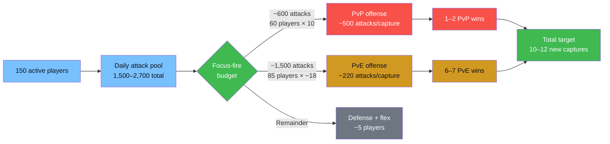

# Round 6 Publicity (2) — Distribution Plan

_Server 2864 · Seal Stone Chaos · Sector 32 · 90-minute battle window_

## Landscape

- **Rank / score:** #46 / 3,900
- **Owned going in:** 13 Lv.3 wastelands + 9 Neutral Cities (2 Lv.3, 3 Lv.2, 4 Lv.1) + Warzone
- **Roster:** ~250 deployed / ~500 marches / **~150 expected active during the 90-min window**
- **Ally this round:** **S1397** (comparable roster + activity — can coordinate tactically)
- **Major threats:** S1397 (ally), **S3396** (biggest real rival), plus everyone else in a secondary tier
- **Declarations on the board:** 45 war targets (25 contested, 20 uncontested) · 6 incoming defensive

## Why attack budget is the binding constraint

Each active player has a **personal daily attack budget** — ~10 attacks if the enemy keeps small ships empty, up to ~18 if they leave smalls manned (compound bonuses). Across ~150 active players that's **1,500 – 2,700 attacks total** for the entire day, spread across every wasteland we want to win.

This forces **aggressive consolidation**. 45 declarations on the board but budget for ~8-10 actual wins — most declarations will be cosmetic/abandoned, and the ally split covers the rest.

## Buff-cap priorities (where new captures help the warzone)

| Effect | Current | Cap | Gap | Priority |
|--------|--------:|----:|----:|:---:|
| DMG Reduction | 45% | 300% | **85%** | 🔴 |
| DMG Increase | 45% | 300% | **85%** | 🔴 |
| HP Buff | 270% | 1800% | **85%** | 🔴 |
| Realm Thief (pass drop) | 10% | 50% | 80% | 🟡 |
| DEF Buff | 30% | 100% | 70% | 🟠 |
| ATK Buff | 540% | 1800% | 70% | 🟠 |
| Train Passenger | 1 | 3 | 67% | 🟢 |
| Realm March Speed | 40% | 100% | 60% | 🟢 |

Combat specs (HP/DMG/DEF/ATK) compound directly in battle — every new capture here makes **all our subsequent fights easier**. They're the top priority.

## Recommended allocation

### Tier A — PvP offense (2 targets, flip-the-table wins)

| # | Wasteland | Spec | Opponent | Garrison | Attack allocation | Notes |
|---|---|---|---|---:|---:|---|
| A1 | **#192** | HP Buff Lv3 | S1120 (1v1) | 40 players | ~400 attacks (all MS, empty smalls) | Closes 85% HP gap. S1120 is secondary-tier → winnable. |
| A2 | **#5** | DMG Increase Lv3 | S1677 (1v1) | 40 players | ~400 attacks | Closes 85% DMG Inc gap. S1677 is secondary-tier. |

**Posture:** Fill Motherships. Leave small ships **empty** on both. Force the enemy down to 10-flat attacks per player.

**Garrison defensive hearts per target:** 40 players × 2 marches × 5 hearts = **400 hearts** (80% MS fill).

### Tier B — PvP offense (ally-assisted)

| # | Wasteland | Spec | Opponent | Plan |
|---|---|---|---|---|
| B1 | **#208** | DMG Increase Lv3 | S3396 | **Ask S1397 to pile-on S3396**. If they commit, we piggyback with 25 players + ~250 attacks. If they don't, concede #208. |

### Tier C — PvE cherry-picks (6 uncontested Lv.3 combat targets)

| # | Wasteland | Spec | Garrison | Attack allocation |
|---|---|---|---:|---:|
| C1 | **#320** | HP Buff Lv3 | 13 players | ~230 attacks (compound) |
| C2 | **#269** | DEF Buff Lv3 | 13 | ~230 |
| C3 | **#250** | DMG Reduction Lv3 | 13 | ~230 |
| C4 | **#47** | ATK Buff Lv3 | 13 | ~230 |
| C5 | **#27** | ATK Buff Lv3 | 13 | ~230 |
| C6 | **#77** | Truck Transport Lv3 | 12 | ~220 |

**Why these six:** all unclaimed, zero contesting servers, all Lv.3. Each clears in ~220 attacks, which 12-13 active players cover with their compound budget (~18 × 12 = 216, tight but works; 15 for safety on higher-value combat).

### Tier D — Defense (token on most, hold on critical)

Garrison only — these don't cost attack budget (defender is passive unless they counter-spend):

| # | Wasteland | Spec | Attackers | Garrison |
|---|---|---|---|---:|
| D1 | **#92** | HP Buff Lv3 | S3940 | 12 players |
| D2 | **#93** | ATK Buff Lv3 | S3940 + S2463 | 4 players (token — likely lose) |
| D3 | **#76** | Truck Transport | S2953 | 2 |
| D4 | **#58** | Realm | S2953 | 2 |
| D5 | **#356** | Realm | S3649 | 2 |
| D6 | **#357** | Truck Heist | S921 | 2 |

**Logic:** #92 is worth a real hold (HP Lv3, 1 attacker, reachable defense). #93 with 2 attackers is a math loss — give a token garrison, redirect the rest. Economy/Realm defenses get 2 players each to slow opportunistic grabs.

### Tier E — Reserves + NC reinforcement

- **NC path reinforcement** (#3004 + #3005 Lv.3 NCs): 10 players, only if Neutral City Declaration phase opens with contest
- **Flex reserve / ally coordination**: 20 players — redeploy after S1397 confirms their targets

### Budget check

| Tier | Garrison | Attack budget |
|------|---:|---:|
| A (2 PvP) | 80 | ~800 |
| B (ally-assist PvP) | 25 (contingent) | ~250 |
| C (6 PvE) | 77 | ~1,380 |
| D (defense) | 24 | 0–100 |
| E (NC + flex) | 30 | 0–200 |
| **Total** | **~236** | **~2,430–2,730** |

Slack of ~14 garrison slots. Attack budget fits the **upper half of the 1,500-2,700 range** — this plan is attack-intensive and assumes compound bonuses on PvE land cleanly. If activity comes in at the low end (1,500), drop Tier B and one PvE target.

## Concede list (withdraw declarations)

| # | Spec | Reason |
|---|---|---|
| #91 | ATK Lv3 | 3-way vs S3396 + S3940 — bleeds budget |
| #225 | DMG Red Lv3 | 3-way vs S3396 + S2463 |
| #111 | DEF Lv3 | Stealing from S2463 (entrenched owner) |
| #215 | DMG Inc Lv3 | Stealing from S208 |
| #229 | DEF Lv2 | Lower level, lower gap-value |
| All 17 contested non-combat | | Below priority threshold |
| 14 of 15 uncontested non-combat | | Keep only #77 (Truck) |

## Ask for S1397

One message to the ally leader, in advance of the Contest window:

> _S2864 plan for R6 Publicity 2: we're pushing #192 (HP vs S1120), #5 (DMG Inc vs S1677), and the 6 uncontested Lv.3 combat targets (#320, #269, #250, #47, #27, #77). We'll concede #91, #225, #111, #215 (all S3396/S2463 fronts) if you can pile on at least one S3396 wasteland — if you hit #208, we join with a 25-player second wave. Please confirm your top 3 targets so we can de-conflict._

## Closing calls

- **If activity trends below 150 active by T-30 min:** drop Tier B (#208) entirely. Keep A + C + minimum D. That still lands ~8 wins.
- **If a Tier C PvE ends up contested in the last 30 min:** concede it (PvE economics don't hold vs a real defender) and redirect to Tier E NC flex.
- **If S1397 commits to #208:** jump in. 25 players = the cheapest extra combat Lv.3 on the board.

---

_Generated 2026-04-22 during Round 6 Publicity (2). Battle mechanics and attack economy per [seal-stone-chaos-event.md](./seal-stone-chaos-event.md) §3. Reviewed by Opus 4.7 and Sonnet 4.6 advisory passes before publication._
